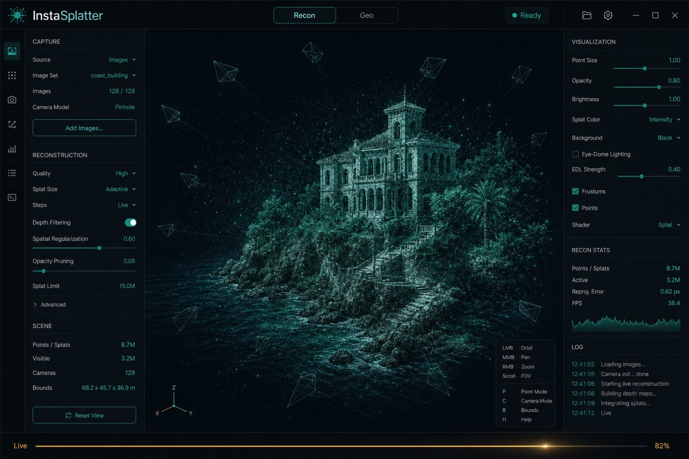
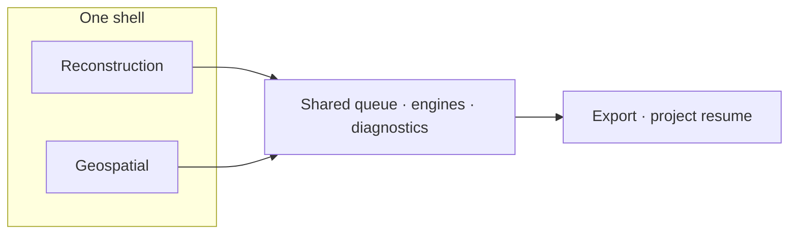
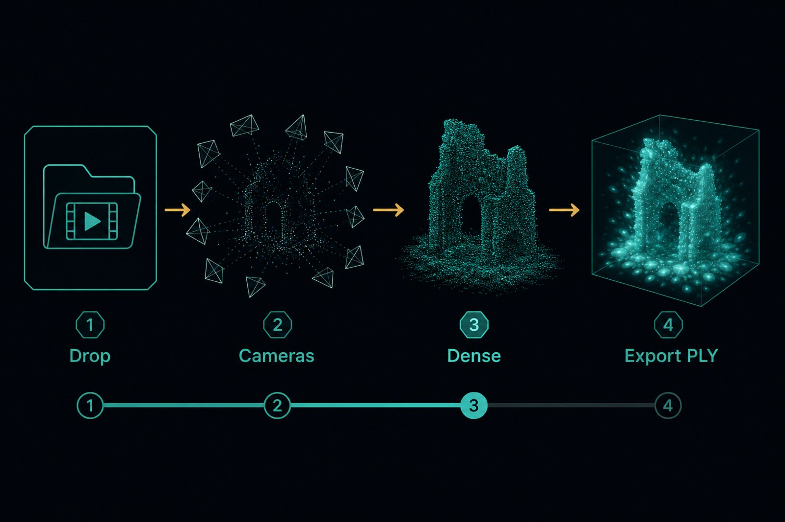
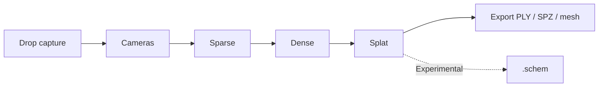
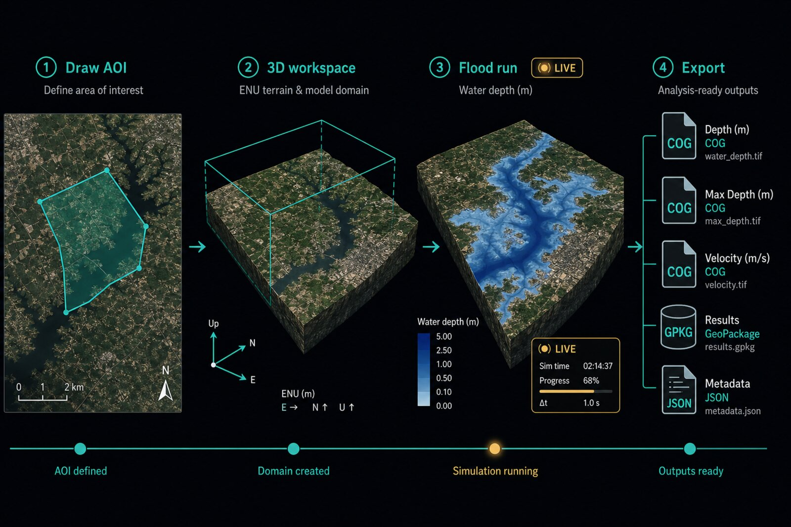
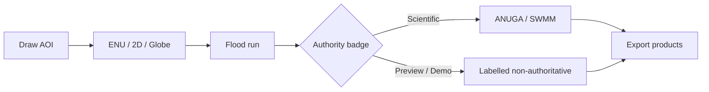

<div align="center">

# InstaSplatter

### Dual suite: live Gaussian reconstruction and local-first geospatial flood analysis.

**Zero-config by default. Every setting exposed underneath.**


[](CONTRIBUTING.md)
[](CODE_OF_CONDUCT.md)

<br />



<sub>Illustrative capture-bay concept — teal pigment brand, brass for live progress. Not a product screenshot.</sub>

</div>

---

> **v0.10.0** adds a CesiumJS **Globe** view, real DEM/catalog connectors, DEM-backed flood preview, and Experimental multi-hazard **data** stubs — see **[RELEASE.md](RELEASE.md)** and verify evidence in **[docs/E2E-GEO-V010.md](docs/E2E-GEO-V010.md)** / **[docs/assets/verify/v0.10/](docs/assets/verify/v0.10/)**. **v0.9.2** revamped shell UX and design skills. **v0.9.1** added Experimental Minecraft `.schem` export. **v0.9.0** shipped the worldwide AOI geospatial suite (ENU + 2D satellite). Flood authority badges stay honest (Live preview / Demo / Scientific). Reconstruction keeps **Standard** vs **Experimental** routing. Research and license notes: **[docs/RESEARCH-STACK.md](docs/RESEARCH-STACK.md)**.

---

## What it is

InstaSplatter turns ordinary captures into photorealistic **3D Gaussian splats**, then — when you switch suites — into a **metrically georeferenced** map with scientific and preview flood runs.

Drop an `.mp4`, a folder of images, or several at once onto the window and the scene materializes in the viewport while it trains. Resolution, frame count, iteration budget, and quality trade-offs are **automatically tuned to your PC**. Power users can open Settings and override every knob; everyone else never has to.



| Suite | Job |
|---|---|
| **Reconstruction** | Capture → cameras → dense evidence → live splat / mesh export |
| **Geospatial** | Draw AOI anywhere → ENU 3D / MapLibre 2D / Cesium Globe → flood scenarios → timed exports |

Switch suites from the TitleBar. Geospatial defaults to the **3D workspace**; toggle **2D satellite** to draw or edit an AOI. Projects are versioned (`v2`) and can carry either suite; reconstruction projects remain loadable.

---

## Example flow — Reconstruction

<div align="center">



<sub>Illustrative pipeline strip — Drop → live stages → export. Not a product screenshot.</sub>

</div>

**Drop → live stages → export**

1. **Drop** a video or image folder onto the home capture plane.
2. Watch **live stages** in the 3D viewport: cameras → sparse → dense → splat (brass marks Live progress).
3. **Export** PLY / SPZ v4 / mesh from the consolidated Export menu. With Experimental Mode on, optionally export a Minecraft `.schem` from the finished splat.



---

## Example flow — Geospatial

<div align="center">



<sub>Illustrative AOI → flood → export strip. Not a product screenshot.</sub>

</div>

**AOI → flood → export**

1. Open or create a geo project; switch suite to **Geospatial**.
2. **Draw an AOI** in 2D satellite (or work in **3D ENU** / **Globe** with DEM terrain and imagery).
3. **Run flood** — scientific (ANUGA/SWMM when installed) or labelled preview / demo. Check the authority badge: Live preview / Demo / Scientific.
4. **Export** COG / GeoPackage / Zarr metadata and manifests.



---

## Dual mode (Standard vs Experimental)

Applies inside both suites where engines are gated:

| | Standard (default) | Experimental (opt-in) |
|---|---|---|
| Reconstruction cameras | Capture-aware commercial chain (VGGT-C, MapAnything, COLMAP) | Profile-matched NC research hypotheses, scored then fused |
| Dense / polish | RoMa v2 ∧ DA3 ∧ MVS; Fixer | Confidence-fuse densifiers; Difix then Fixer |
| Flood | ANUGA Domain.evolve when installed+DEM (+ SWMM network); labelled demo/scaffold otherwise | TRITON / Wflow / GeoClaw external; GPL engines plugin-only |
| Other hazards | Flood-only simulation on Standard | Quake / fire / landslide / tsunami = feed/STAC stubs only (no fake physics) |
| Preview | WebGPU/CPU soft solver labelled **non-authoritative** | Same preview path; never promoted without gates |
| License | Commercial-safe defaults | NC research after one-time ack; GPL never bundled |

Experimental is a single TitleBar control (+ discrete banner). Open **About** for Standard vs Experimental stacks, geospatial engines, sidecars, and license/attribution (including Esri World Imagery). NC weights and GPL hydro binaries are never shipped in the installer. See [tools/sidecars/README.md](tools/sidecars/README.md).

---

## Why it is different

- **Two suites, one shell.** Reconstruction and geospatial share queue, engines, diagnostics, and Standard/Experimental policy.
- **Live, not batch.** Watch cameras → sparse → dense → splat stages in 3D; scrub a hydrograph linked to the flood waterline.
- **AOI anywhere.** Draw a flood domain worldwide; soft-solver and scientific extent rebind off the box (not Wellington-locked).
- **Metric when possible.** EXIF/DJI/GCP → ENU/ECEF; unscaled scenes stay clearly labelled.
- **Science vs graphics.** ANUGA/SWMM for authoritative runs after calibration; live preview stays a badge until within tolerances. Demo/uncalibrated exports never claim authority.
- **One cross-vendor binary.** Brush on wgpu runs on NVIDIA, AMD, and Intel. No CUDA or Python required for the base install.
- **Local and private.** All processing runs on your machine.

---

## Features

| | |
|---|---|
| **Input** | Video, image folders, batch queue; geospatial telemetry/GCP CSV |
| **Camera solving** | Scored capture-aware routing, COLMAP 4.1 pose priors / BA |
| **Dense init** | Schema v2 sidecars, Sim(3) fusion, gsplat `init.ply` |
| **Live reconstruction** | Sparse/dense clouds + frustums + Brush/gsplat PLY hot-swap in one 3D viewport |
| **Geospatial 3D** | ENU workspace: Esri imagery terrain, depth water, editable splat gizmos |
| **Geospatial Globe** | CesiumJS globe with local DEM terrain + flood overlay (no ion required on Standard) |
| **Geospatial 2D** | MapLibre satellite + AOI draw + flood depth overlay |
| **Flood** | ANUGA/SWMM scientific path + DEM-backed preview / HAND + demo fallback |
| **Exports** | Splat PLY/SPZ v4; flood COG/GeoPackage/Zarr metadata/manifests; Experimental Minecraft `.schem` |
| **Modes** | Suite switch + Standard / Experimental + About implementations |
| **Resume** | Project bundles with checkpoint resume |

---

## Requirements

| | Minimum | Recommended |
|---|---|---|
| **OS** | Windows 10/11 (64-bit) primary; Linux / macOS best-effort via CI | Windows 11 (64-bit) |
| **GPU** | Any Vulkan/DX12/Metal-capable GPU | Dedicated GPU with 6+ GB VRAM |
| **RAM** | 16 GB | 32 GB |
| **Disk** | A few GB free for cache | SSD recommended |

---

## Installation

Installers are published on [GitHub Releases](https://github.com/ericcayers-ai/instasplatter/releases) after a tagged CI run (see **[RELEASE.md](RELEASE.md)**). **Windows NSIS** is the primary supported package; Linux AppImage/`.deb` and macOS `.dmg` are best-effort. For v0.10, macOS dmgs are **unsigned / ad-hoc** (no notarization secrets) — right-click → Open on first launch if Gatekeeper blocks.

COLMAP and Brush download automatically on first run (~200 MB). Video input needs FFmpeg on `PATH`:

```
winget install ffmpeg
```

Optional scientific flood: install the ANUGA/SWMM workers under the engines path (see `tools/sidecars/anuga` and `tools/sidecars/swmm`). Without them, geospatial flood runs a **labelled demo** path — not scientifically authoritative.

### Building from source

Prereqs: **Rust** (stable), **Node.js 20+**, **FFmpeg** on PATH. On Windows use the MSVC toolchain.

```bash
npm install
npm run tauri dev      # development
npm run tauri build    # bundles under src-tauri/target/release/bundle
```

**Linux (Debian/Ubuntu):** install WebKitGTK 4.1 and related deps before building:

```bash
sudo apt-get update
sudo apt-get install -y \
  libwebkit2gtk-4.1-dev \
  libayatana-appindicator3-dev \
  librsvg2-dev \
  patchelf \
  libssl-dev \
  libgtk-3-dev \
  xdg-utils
```

Multi-platform CI matrix: [`.github/workflows/release.yml`](.github/workflows/release.yml) (`workflow_dispatch` or tag `v*`). Details and publish gates: **[RELEASE.md](RELEASE.md)**.

---

## Usage

1. **Launch** InstaSplatter. It detects your hardware and picks a preset.
2. Pick a **suite**: Reconstruction or Geospatial (TitleBar).
3. **Reconstruction** — drag a video or image folder; watch live stages (cameras / sparse / dense / splat); export PLY/SPZ/mesh. With Experimental Mode on, export a Minecraft `.schem` schematic from the finished splat.
4. **Geospatial** — open/create a geo project, draw an AOI in 2D (or work in ENU / Globe), run flood scientific or preview, export products with manifests. Check the authority badge (Live preview / Demo / Scientific).
5. _(Optional)_ Settings groups, Experimental Mode (NC ack), or **About** for stacks and attribution.

---

## Roadmap / release gates

- **v0.8**: suites, georeg, viewport, dual flood engines, exports, experimental adapters.
- **v0.9**: worldwide AOI, Esri imagery, 3D ENU workspace, live recon stages, Settings/About cleanup, shell QOL (v0.9.2).
- **v0.10** (this release): Cesium Globe, real DEM/catalog connectors, flood realism, multi-platform installer CI; tag/publish blocked until MANUAL verify captures or waiver — see [`docs/assets/verify/v0.10/VERIFY-SUMMARY.md`](docs/assets/verify/v0.10/VERIFY-SUMMARY.md).
- **v1.0**: large-scene tiling, uncertainty ensembles, full ANUGA validation suite, multi-drone RTK/GCP truth sets, site/city benchmarks, accessibility + installer migration audit.

See also **[ROADMAP-V2.md](ROADMAP-V2.md)** and **[ROADMAP.md](ROADMAP.md)**.

---

## Contributing

See [CONTRIBUTING.md](CONTRIBUTING.md). By participating you agree to the [Code of Conduct](CODE_OF_CONDUCT.md).

## License

Apache-2.0. Third-party notices and research sidecar licenses are documented in [docs/RESEARCH-STACK.md](docs/RESEARCH-STACK.md) and [About](src/components/shell/AboutPanel.tsx) in-app.
